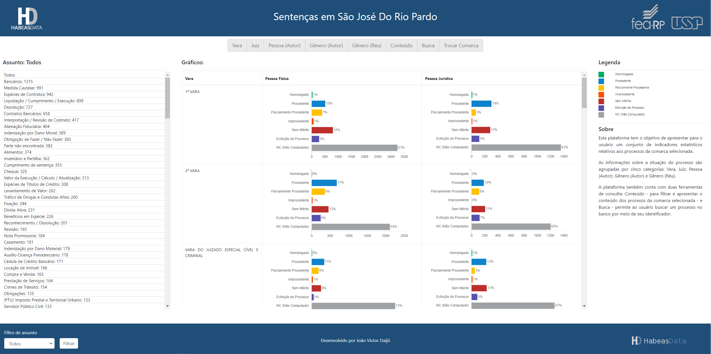

<!-- PROJECT LOGO -->
<br />
<p align="center">
  <a href="https://github.com/othneildrew/Best-README-Template">
    
  </a>

  <h3 align="center">Habeas Data</h3>

  <p align="center">
    Dashboard para explorar uma base de processos
  </p>
</p>

## Sobre o Projeto

Uma dashboard para explorar os processos contidos na base do Habeas Data.



O usuário pode selecionar qualquer comarca paulista e então acessa um conjunto de estatísticas da sua escolha.

Também é possível consultar o conteúdo dos processos retornados ou buscar um processo específico no servidor remoto por meio de seu número.

## Dados

As informações são carregadas em arrays associativos, estes dados são recuperadas remotamente de um servidor MongoDB.

Por exemplo:

```sh
Array
(
    [1ª VARA] => Array
        (
            [fisica] => Array
                (
                    [nc] => 3247
                    [extincao_do_processo] => 282
                    [sem_merito] => 803
                    [procedente] => 513
                    [parcialmente_procedente] => 395
                    [improcedente] => 75
                    [homologado] => 35
                )

            [juridica] => Array
                (
                    [nc] => 1358
                    [extincao_do_processo] => 118
                    [improcedente] => 13
                    [sem_merito] => 284
                    [procedente] => 303
                    [parcialmente_procedente] => 66
                    [homologado] => 13
                )

        )

    [2ª VARA] => Array
        (
            [fisica] => Array
                (
                    [nc] => 2114
                    [sem_merito] => 455
                    [procedente] => 677
                    [parcialmente_procedente] => 357
                    [extincao_do_processo] => 243
                    [improcedente] => 25
                    [homologado] => 9
                )

            [juridica] => Array
                (
                    [nc] => 1202
                    [procedente] => 187
                    [sem_merito] => 206
                    [extincao_do_processo] => 123
                    [parcialmente_procedente] => 116
                    [improcedente] => 3
                    [homologado] => 2
                )

        )
)
```

As informações parseadas e processadas são convertidas em JSON e armazendas num banco local, simulando um cache simples e evitando consultas remotas constantes.